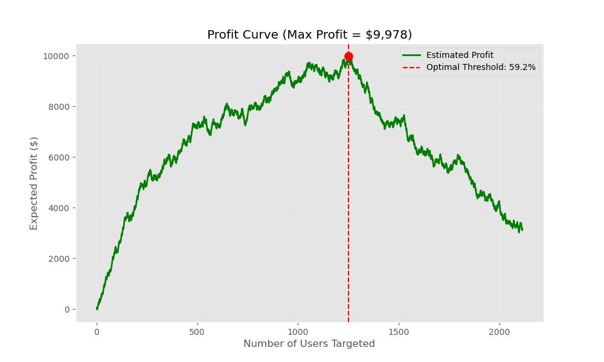

# Causal Uplift Modeling for Telco Churn Reduction 🚀


## 📖 Executive Summary

This project develops an end-to-end causal uplift modeling pipeline to optimize customer retention strategies.

Unlike traditional churn prediction models that estimate churn probability, uplift modeling focuses on estimating the **incremental treatment effect (CATE)** — identifying customers who are likely to respond positively to an intervention (e.g., discount offers).

Using a simulated Randomized Controlled Trial (RCT) framework, I implemented both **T-Learner** and **X-Learner** meta-algorithms with XGBoost as the base learner. The X-Learner demonstrates superior ranking performance (Spearman = 0.87) and higher AUUC/Qini scores, leading to significant profit improvement under realistic treatment cost assumptions.


## 📊 Key Results & Visualizations

### 1. Business Impact: Profit Curve 
The model identifies the optimal targeting threshold. By targeting the top **59%** of users based on Uplift Score, we maximize expected profit to **~$10k** (per 7k users), avoiding waste on users who would stay anyway or leave regardless of the offer.


### 2. Strategic Resource Allocation: Incremental Retention
Beyond profit, we analyze the volume of saved customers relative to targeting coverage. 
 
* **High Efficiency**: Targeting the top 20% of users captures nearly 70 incremental retentions.
* **Decision Support**: Helps stakeholders decide on thresholds based on available marketing budget.

### 3. Model Interpretability: SHAP Analysis
Using SHAP values to interpret the CATE (Conditional Average Treatment Effect), we discovered that **Month-to-month contract** users with high tenure are the most responsive segment. This confirms our hypothesis that long-term users on flexible contracts are the most "Persuadable."


### 4. Model Performance: Qini Curve
The X-Learner (Pink line) significantly outperforms the T-Learner (Baseline) and Random selection. The Area Under Uplift Curve (AUUC) is **0.68**, indicating strong ranking ability.


### 5. Model Reliability: Calibration Plot
The model is well-calibrated. Users predicted to have high uplift (Decile 1) actually showed the highest true uplift in the validation set, proving the model's reliability for real-world deployment.


### 6. Data Context: Churn by Contract
EDA reveals that Month-to-month users have a significantly higher baseline churn rate, making them the primary target pool for retention experiments.


---

## 🛠️ Technical Implementation

### Core Components
* **Causal Inference Framework**: Implemented **X-Learner** and **T-Learner** meta-algorithms.
* **Base Learner**: Utilized **XGBoost Regressor** and **Classifier** for outcome prediction.
* **Evaluation Metrics**: AUUC (Area Under Uplift Curve), Qini Coefficient, and Decile Calibration.
* **Simulation**: Generated synthetic ground-truth uplift labels to validate model accuracy (Spearman Correlation: **0.87**).

### Code Structure

The `XLearner` class is implemented with a Scikit-Learn compatible API to ensure modularity and reusability:

```python
class XLearner(BaseEstimator, RegressorMixin):
    def fit(self, X, y, t):
        """
        Stage 1:
            Train separate outcome models:
                μ0(x) = E[Y | X, T=0]
                μ1(x) = E[Y | X, T=1]

        Stage 2:
            Construct pseudo-outcomes and regress them to estimate:
                τ(x) = E[Y(1) - Y(0) | X]
        """
